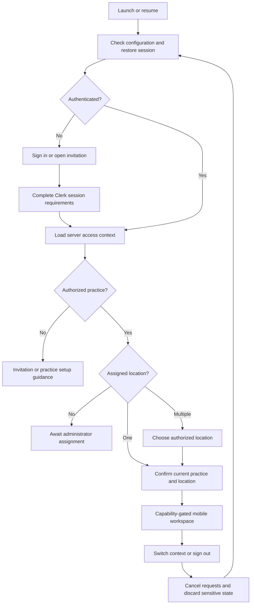

# CareIQ mobile architecture and bootstrap proposal

**Status:** Proposed for review. The bootstrap is authorized; product workflows and production release remain future work.

**Review baseline:** `7dcc510`. This proposal was written before adding mobile implementation files. Read it alongside [ADR-017: Practice, Location and Membership Model](../decisions/017-practice-location-membership-model.md). The requested number ADR-013 is already occupied by the accepted storage decision, so the new proposal uses the next available number. Prior accepted ADRs remain in force except for explicit amendments recorded by the new decision.

## 1. Existing architecture and constraints

The repository already uses pnpm `11.22.0`, one root workspace for `apps/*` and `packages/*`, and recursive scripts. `apps/web` is Next.js 16 with React 19.2.8 and Clerk; `apps/api` is Express with Clerk, Drizzle and PostgreSQL; `apps/marketing` is a separate Next.js application. The only existing shared package, `@careiq/interview-contract`, describes the public interview form. It is not a clinical API contract.

Accepted decisions already provide the mobile foundation:

- [ADR-004](../decisions/004-multi-tenant-saas.md) and [ADR-005](../decisions/005-authentication-authorization.md): a practice maps to a Clerk Organization; Clerk manages identity and practice membership.
- [ADR-006](../decisions/006-database-platform.md), [ADR-007](../decisions/007-multi-tenant-data-isolation.md) and [ADR-009](../decisions/009-identifier-strategy.md): PostgreSQL domain data, tenant isolation and internal identifiers stay behind the API.
- [ADR-010](../decisions/010-audit-logging-architecture.md) and [ADR-011](../decisions/011-api-architecture-and-versioning.md): server audit context and versioned JSON REST remain the platform boundary.
- [ADR-013](../decisions/013-file-and-doc-storage-architecture.md) and [ADR-014](../decisions/014-environment-config-secrets-management.md): existing storage and environment decisions remain applicable. Mobile does not introduce another document store or secret distribution mechanism.

Today the API resolves a validated active Clerk organization to an internal practice. Its tenant middleware has no location context. `GET /api/v1/me` can provision the practice, so it is not an inert connectivity probe. Patients and appointments are practice scoped. `GET /health` is public and reports API/database availability. These facts constrain the bootstrap: it must not imply that location isolation, invitation acceptance or native authenticated access already works.

## 2. Recommended platform and app boundaries

Add `apps/mobile` for iOS and Android using Expo SDK 57, React Native, TypeScript and Expo Router. Use Expo Continuous Native Generation: app configuration and config plugins are the source of truth, with generated `ios/` and `android/` directories ignored. There is no current requirement for manually maintained native projects. If a later native integration requires custom code, first evaluate an Expo module/config plugin; use bare React Native only after documenting the unsupported requirement.

Version baseline verified on 2026-10-04: Expo `57.0.26`, React Native `0.86.3`, React `19.2.3`, and Expo Router `~57.0.24`. SDK 57 requires Node.js 22.13 or later, targets Android 7+ and iOS 16.4+, and its documented iOS toolchain requires Xcode 26.4+. Use the published SDK compatibility map and `expo install --check` when selecting package patches; do not independently upgrade React Native. These requirements are subject to later SDK and store changes. [Expo SDK reference](https://docs.expo.dev/versions/latest/), [SDK 57 dependency map](https://raw.githubusercontent.com/expo/expo/sdk-57/packages/expo/bundledNativeModules.json)

Clerk's bundled native module currently requires iOS 17.0 and is registered for autolinking even when only its JavaScript provider is used. The proposed app minimum is therefore **iOS 17**, subject to confirming the installed package's native configuration. Include the Clerk config plugin for its native build settings, with `appleSignIn: false` until that capability is deliberately selected. Do not advertise Expo's lower platform minimum as the minimum of the complete CareIQ app. [Clerk native pod specification](https://github.com/clerk/javascript/blob/main/packages/expo/ios/ClerkExpo.podspec), [Clerk config plugin](https://github.com/clerk/javascript/blob/main/packages/expo/app.plugin.js)

| Boundary | Responsibility |
| --- | --- |
| `apps/mobile` | Native navigation, screens, accessibility, app lifecycle, Clerk native provider, device storage adapter and mobile environment configuration. |
| `apps/web` | Existing web workflows, Next.js routes, server rendering, browser presentation and web Clerk integration. |
| `apps/api` | Identity verification, practice/location authorization, business rules, validation, persistence and audit events for every client. |
| Future shared packages | Platform independent API contracts, validated domain values and a transport accepting injected configuration/token access. Extract only when a real second consumer exists. |

Mobile does not call Next.js route handlers or Server Actions and never connects to the database. Next.js remains the web application; Expo's web target is not a replacement website or a delivery requirement for this change.

## 3. Exactly what the first scaffold will contain

The implementation following this proposal is limited to:

1. An Expo Router stack with a foundation/home route and a setup route, using native components and safe areas.
2. App-local validation of public API origin and optional Clerk publishable key, with a readable setup state when configuration is absent or invalid.
3. An optional `ClerkProvider` using Clerk's secure token cache only when a valid-looking public key is configured. Local format validation does not prove that the key belongs to a working Clerk instance.
4. A TanStack Query provider and a manually initiated, cancellable `GET /health` check. The query is memory only, sends no token and does not run automatically on launch or app focus.
5. Workspace scripts, TypeScript/lint configuration, a public `.env.example`, ignored native/build artifacts, and EAS development, preview and production profile templates.
6. Documentation and verification of configuration and JavaScript bundling where local tools permit.

There will be no sign-in form, invitation acceptance, organization/location switching, `/me` request, clinical data request, patient screen, offline clinical store, push notification, camera access, new database table or shared package. EAS account/project creation, signing setup, cloud builds, store submissions and OTA publishing are separate operator actions. A scaffold screen must call these capabilities planned, not available.

## 4. Authentication and session design

Use `@clerk/expo` in mobile and keep `@clerk/nextjs` in web. Both clients will use the appropriate instance of the same CareIQ Clerk application for their environment. Mobile receives only the publishable key. Clerk secrets, database credentials and signing credentials never enter the application bundle.

Place `ClerkProvider` above navigation and pass `tokenCache` from `@clerk/expo/token-cache`, backed by `expo-secure-store`. This is credential persistence, not an offline authorization grant. Clerk remains responsible for session/token lifecycle. Sign-out must clear app state as well as ending the session. Validate revoked/expired sessions with the server before displaying protected data after resume. [Clerk Expo quickstart](https://clerk.com/docs/expo/getting-started/quickstart)

For the next increment, review Clerk hosted authentication against native Clerk components. Hosted authentication minimizes custom handling of passwords, MFA and session tasks; native components require a development build. Whichever flow is selected must support the configured sign-in policies, required session tasks, cancellation, recovery, invite links, account switching and sign-out. Use supported SDK methods for browser callbacks and session activation; do not copy web cookies, embed a browser login in an arbitrary WebView, or parse a callback token into trusted tenant state.

Before production, register the actual iOS bundle identifier and Android package with Clerk, configure the chosen native/hosted authentication flow, and verify exact callback behavior in development builds. Universal/App Links for invitations need owned-domain association files and a web fallback. An invitation can identify a pending practice invitation but cannot itself grant location access; the server must confirm acceptance and applicable assignments.

**Native authenticated API proof is a release gate.** At this baseline `apps/api/src/index.ts` passes the same HTTP(S) origin list to CORS and Clerk `authorizedParties`. CORS is a browser policy, not native API authentication. Test actual native session tokens and the verified `azp` behavior against the current server before activating protected mobile calls. If native support requires configuration changes, introduce a deliberate Clerk authorized-party configuration with tests while preserving the browser allowlist. Do not remove validation or add `*` to make a prototype work. [Clerk token verification](https://clerk.com/docs/reference/backend/verify-token)

## 5. API contracts and migration

Protected mobile requests will use the existing HTTPS `/api/v1` API, fresh Clerk bearer tokens obtained at request time, the existing error envelope, pagination and bounded timeouts. Configure the origin without `/api/v1`; each endpoint owns its complete path. Authorization headers must never be sent to the public health endpoint or arbitrary user-supplied URLs. Do not import `apps/web/src/lib/api/client.ts`: it reads Next.js environment variables and uses browser request options. Its contract conventions are useful; its runtime belongs to web.

Before implementing clinical screens, define a server-issued access-context response with the current user, internal practice ID, authorized locations, effective capabilities and an authorization revision. This is a proposed contract, not an endpoint implemented by this scaffold. The server validates the requested location belongs to the resolved practice and the current membership permits the operation. Tenant or location IDs from route parameters, storage or links are selectors only.

Roll out location isolation in the order defined by the practice/location ADR: schema and explicit backfill, server authorization, then clients. Existing records need an explicit migration rule; do not silently make unassigned data visible across every location. Design additive `/api/v1` fields and endpoints where compatibility permits. If enforcing mandatory location context breaks old clients, retain a safe compatibility path only if it preserves isolation; otherwise introduce a version/minimum-client gate with a clear update-required response. Mobile store releases can remain installed for months, so server rollout must not assume simultaneous client updates. No compatibility fallback may broaden access. [ADR-011](../decisions/011-api-architecture-and-versioning.md)

For writes later, preserve one idempotency key across a retry of the same operation and surface that a timed-out write may have committed. Retry reads selectively; do not automatically retry clinical mutations or replay writes after an app restart. Contract tests must cover envelopes, denied location access, pagination and supported older client behavior.

## 6. Practice/location context and data fetching

Use React state for transient UI choices and TanStack Query for server state. No Redux or extra global store is needed initially. The bootstrap query key includes the API origin and `health`; it holds no patient data. There is no persisted query cache or automatic background refetch.

The future authenticated query boundary is:

```text
[userId, sessionId, practiceId, locationId, authorizationRevision, resource, parameters]
```

Use a server-issued authorization revision/capability version rather than a role label alone. A selected location never substitutes for authorization. Practice membership without a usable location enters an awaiting-assignment state. Practice-wide administration must be an explicit capability and route scope; it must not use a missing location as a wildcard for clinical reads.

Before clinical implementation, provide one transition boundary for sign-out, identity/practice/location changes, access revocation and app backgrounding. Block protected rendering, cancel requests, discard query caches and sensitive form drafts, then validate the new context before fetching. Discard late responses from the previous context even if transport cancellation races. On resume, revalidate the session/access context before restoring clinical UI. The current scaffold does not implement this clinical boundary because it has no clinical state.

Keep mobile auth tokens in SecureStore only. Avoid patient data, invitation secrets or token copies in AsyncStorage, route URLs, analytics, logs, crash breadcrumbs, clipboard or push payloads. SecureStore has platform-specific uninstall/backup behavior; it is not a general clinical data store. Offline clinical support, screenshot/app-switcher protections and any biometric re-entry policy require a separate reviewed increment. [Expo SecureStore](https://docs.expo.dev/versions/latest/sdk/securestore/)

## 7. Navigation and reviewable screen design

Expo Router provides native stack navigation and deep-link routing. Start with two routes rather than empty product tabs. Reuse design tokens and vocabulary from web when useful, with native layout, text scaling, accessible labels, touch targets and platform back behavior.

Bootstrap wireframes:

```text
Foundation                               Setup
┌──────────────────────────────┐         ┌──────────────────────────────┐
│ CareIQ                       │         │ ‹ Back        Setup          │
│ Mobile foundation            │         │ API configuration            │
│                              │         │ Ready / Missing / Invalid    │
│ iOS and Android foundation   │         │                              │
│ Practice and location access │         │ Authentication configuration │
│ is planned.                  │         │ Ready / Not configured       │
│                              │         │                              │
│ [Open setup]                 │ ──────► │ [Check connection]           │
│                              │         │ Not checked / Checking /     │
│                              │         │ Available / Unavailable      │
└──────────────────────────────┘         └──────────────────────────────┘
```

Configuration status must not display raw keys or claim that a session is authenticated. Connection success proves only the configured service's health response. Errors should identify a recoverable action without printing server bodies or secrets.

Future user flow, for design review before implementation:



The future workspace should keep practice/location visible in its header and provide an accessible switch action. A user with multiple authorized locations can switch without creating another account. Invite acceptance and assignment are separate states. Initial practice creation, location management and staff administration can remain web-first while the mobile workflow is validated. Selecting the first clinical mobile workflow is a product decision still to review.

## 8. Sharing with Next.js and workspace configuration

Share concepts and stable contracts: internal identifier types, DTOs, runtime validation where truly common, date/domain helpers and eventually visual tokens. A future shared API transport must accept its base URL, token getter, cancellation signal and fetch implementation; it must not read a platform's environment or storage directly.

Keep DOM components, Tailwind/CSS, Next.js routes/Server Actions, React Server Components, browser Clerk components, native navigation, device permissions and SecureStore adapters in their apps. Avoid importing server implementation or database models into either client. Do not convert the existing interview contract into an unrelated catch-all package.

Retain pnpm's isolated workspace installs. Modern Expo detects the workspace and configures Metro via `expo/metro-config`; no custom `watchFolders`, dependency aliases or global hoisting is needed without a demonstrated dependency issue. Use app-local React versions supported by their frameworks: mobile React 19.2.3 and existing web React 19.2.8 can coexist so long as each app resolves one React instance and shared UI does not bundle its own React. Avoid a root React override. [Expo monorepos](https://docs.expo.dev/guides/monorepos/)

The app should extend `expo/tsconfig.base`; do not force the Next.js and server compiler configurations into a new shared package. Keep native launch/export tasks explicitly available from the root without making ordinary web/API development unexpectedly require a simulator. Keep the root pnpm lockfile authoritative.

## 9. Environment, builds and release

Use app-local `.env.local` for development and commit only `.env.example`. `EXPO_PUBLIC_API_URL` and `EXPO_PUBLIC_CLERK_PUBLISHABLE_KEY` are public build inputs. Expo inlines static dot-property references to `process.env.EXPO_PUBLIC_*`; these values are readable in the bundle. Never put secrets in app configuration or `extra`, even without the `EXPO_PUBLIC_` prefix. Use a separate app-variant setting for environment selection; `NODE_ENV` controls bundling and is not a deployment environment switch. [Expo environment variables](https://docs.expo.dev/guides/environment-variables/)

Allow HTTP only for explicitly local development targets; preview and production require HTTPS. Missing configuration should leave the scaffold usable in setup mode. Before real releases, require complete, environment-consistent API/Clerk settings and actual app identifiers. iOS Simulator can reach a host API through `localhost`; Android Emulator commonly uses `10.0.2.2`; a physical device needs a reachable LAN origin or a deliberate development HTTPS endpoint. Host API binding, local firewall and native transport policy must be checked; do not weaken production transport security.

Use EAS profile templates under `apps/mobile/eas.json`:

| Profile | Intended use | Remaining setup |
| --- | --- | --- |
| Development | Custom development client, local testing and optional internal device builds. | Native toolchains or EAS account, development app IDs, Clerk configuration. |
| Preview | Internal distribution against isolated non-production services. | Signing/device registration where required, preview identifiers and environment. |
| Production | Store binary using production API and Clerk settings. | Confirm owned identifiers, signing, store records, privacy disclosures and release review. |

Use distinct app IDs/schemes for environments before distributing simultaneous installations; provisional identifiers in a scaffold are not registered ownership. Run EAS commands from `apps/mobile`; keep build configuration there. Root package installation must remain reproducible with the repository's pnpm version. No postinstall hook should build web/API merely to produce a mobile binary. [EAS monorepo builds](https://docs.expo.dev/build-reference/build-with-monorepos/), [Expo app variants](https://docs.expo.dev/build-reference/variants/)

Use development builds for this scaffold and for auth/deep-link/native testing. Expo Go compatibility has not been established with the included native Clerk module. Native dependency or app-config changes require a rebuilt development client. JavaScript export alone does not prove that a native binary compiles or launches. [Development builds](https://docs.expo.dev/develop/development-builds/introduction/)

Do not configure OTA publishing in the bootstrap. A later EAS Update decision must address signing, runtime compatibility, environment/channel separation, rollback and change approval. Native changes still require a store binary. Before release choose supported minimum client versions, retain API compatibility, test store-style release builds, and use staged distribution with a documented rollback path.

## 10. Testing and acceptance

Bootstrap acceptance is intentionally narrow:

- Clean pnpm install succeeds without changing the existing web/API framework versions.
- Mobile typecheck/lint and focused tests for public configuration and health response/error handling pass.
- Both iOS and Android JavaScript bundles export using synthetic/no credentials; missing configuration renders setup rather than crashing.
- Manual health checks support success, unavailable API, timeout and retry without authentication or clinical traffic.
- Existing workspace checks still pass, or environmental/pre-existing blockers are recorded explicitly.
- Documentation lists native checks separately from bundle checks. No native or authenticated flow is reported tested without running it.

Before clinical mobile work, add React Native component tests for session/context gates and navigation states, API integration tests for isolation and membership revocation, and device end-to-end tests for sign-in, invite handling, location switching, background/resume, expired/revoked sessions, offline recovery and sign-out. Include two practices and two isolated locations with an intentionally unauthorized user. Test delayed requests during context switches. CI should run deterministic unit/contract checks; simulator/device builds belong in a separate, deliberately configured job. Use synthetic data in screenshots and fixtures.

## 11. Local setup and next review decisions

The companion [mobile development guide](../mobile-development.md) contains the exact scripts implemented by the scaffold. The intended workflow is root `pnpm install`, copy the mobile environment example into an ignored local file, start the API if testing health, then start Expo from the mobile workspace. Developers can inspect both bootstrap routes before configuring Clerk.

Native setup still requires a compatible Node/pnpm installation, Xcode and an installed simulator runtime for local iOS builds, or Android Studio/JDK/SDK and an emulator for Android. EAS builds additionally require an Expo account/project and signing setup. Device distribution and stores require the applicable Apple/Google developer accounts. Verify the current toolchain and account requirements when provisioning them; no accounts or paid services are created by this task.

Review these decisions next:

1. Approve the practice/location ADR, especially location isolation, practice-wide administration, default-location migration and pending assignment behavior.
2. Confirm the first mobile clinical workflow and whether mobile practice administration stays deferred.
3. Choose hosted or native Clerk sign-in and prove native bearer-token verification against the API's authorized-party policy.
4. Approve the access-context contract, client compatibility gate and cache/foreground privacy behavior before clinical data is fetched.
5. Confirm owned app identifiers, minimum OS support, environment ownership, EAS/store accounts and release process.

This document records a proposal and intended bootstrap acceptance, not a claim that those checks or future capabilities have already been completed.
